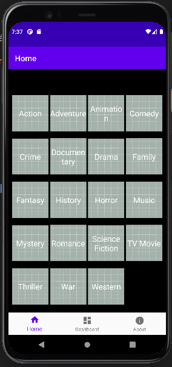
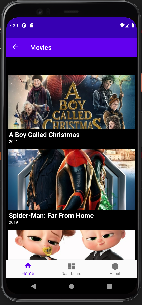
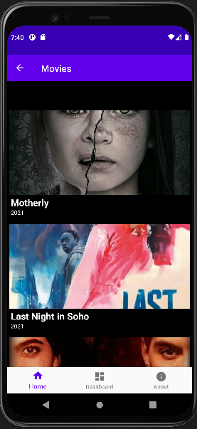
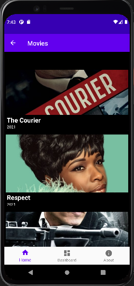
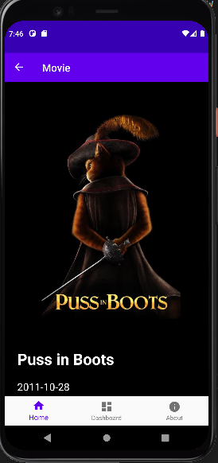
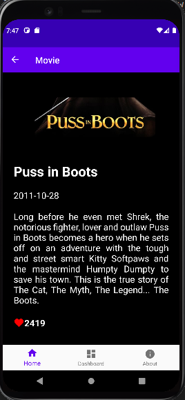
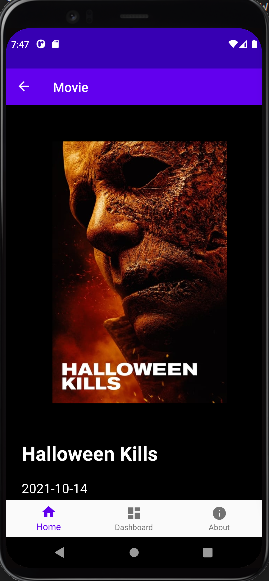
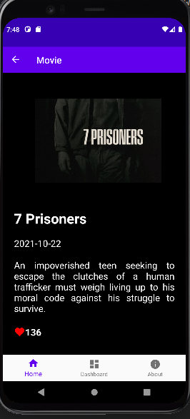
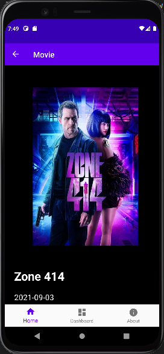
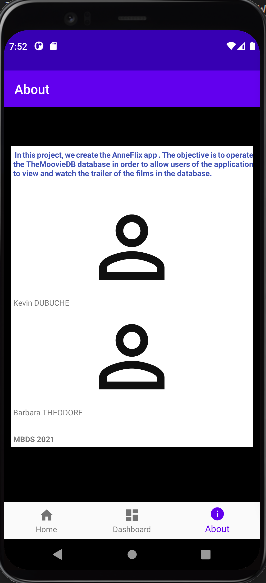

# Projet Android MBDS
- 2021-2022
- Professeur : Amosse EDOUARD

# QUOI ?
Projet de fin de cours d'Android/Kotlin.
Il s'agit d'un projet dans lequel nous créons l'application AnneFlix (The new Netflix).
L'objectif est d'exploiter la base de données TheMoovieDB.

# QUAND ?
Année académique 2021-2022

# OU ?
MBDS

# COMMENT ?
## Coté technique
- Kotlin | Architecture Components | Data Binding | Retrofit | Room | ...
- Lirairies : Navigation-fragment | Hilt | Gson | Retrofit | Picasso | Glide | OkHttp | ...

# Réalisations
## Animation

## Liste des catégories de movies

## Liste des movies d'une catégorie spécifique

## Détails d'un movie

## About

# Sources
- Cours Android MBDS
- TMDB [Lien](hhttps://www.themoviedb.org/)
- Medium [Lien](https://medium.com/androiddevelopers)
- Stackoverflow
- Youtube
- ...

